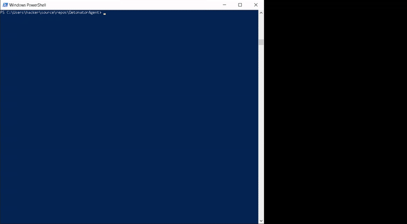

# DetonatorAgent

A cross-platform Web API for MalDev execution and EDR log collection for RedTeamers.


## Purpose

DetonatorAgent fulfills two purposes:

* File execution
* EDR log collection

It is mainly used to see if initial access chains are undetected for RedTeam engagements.
So if your malware is detected (and if yes, why), or not.

It serves more as inspiration on how to implement this yourselves than a polished product.
It is closely related to [RedEdr](https://github.com/dobin/RedEdr), which collects the same
telemetry as an EDR does. And can be used with [Detonator](https://github.com/dobin/Detonator)
to more reliably detonate MalDev, as shown in [detonator.r00ted.ch](https://detonator.r00ted.ch).
A presentation "Detonator - Repeatable Malware Technique Testing" (given at RTS EMEA 25) will
be made publicly available sometimes maybe. 

Note: This has been largely Vibe-Coded.


## Feature: File Execution

The `/api/execute/exec` API will execute the given file. So the EDR (or AV) can do its thing.


### Execution Mode: Direct

This will write the given file into the selected directory (`drop_path`). 

If it's a .zip, the content of it will be extracted. If it contains more than one file,
the alphabetically first one will used as executable.

Execution is performed with `Process.start()` with `UseShellExecute=true`, which means
that the file has to have a valid Windows execution handler. For .exe files, it is possible
to give arguments. 

The exception is for `.dll`, which is executed with `rundll32.exe`. The file argument
is then used as DLL export which will be called:
```
rundll32.exe <filepath>,<argument>
```


### Execution Mode: AutoIt

It is intended to simulate a user "clicking" the malware: It will use the Windows integrated
default app association to start the file (be it .exe, .lnk, or others). 

The containers `.zip` and `.iso` will be clicked in explorer to be opened. 
The alphabetically first file will be double-clicked.




## Feature: EDR Log retrieval

The `/api/logs/edr` will return the log files of your EDR product. 

Currently only Microsoft Defender / MDE is supported.
Currently it returns all Defender event logs entries between execution of `/api/exec/execute` and calling
of this API. If nothing has been executed before, it returns all event logs.

See `scan-file.ps1` how to preferably use this. 

Example:
```
> curl.exe http://localhost:8080/api/logs/edr                                                        
{"logs":"<Events>\r\n<Event xmlns='http://schemas.microsoft.com/win/2004/08/events/event'><System><Provider Name='Microsoft-Windows-Windows Defender' Guid='{11cd958a-c507-4ef3-b3f2-5fd9dfbd2c78}'/><EventID>1150</EventID><Version>0</Version><Level>4</Level><Task>0</Task><Opcode>0</Opcode><Keywords>0x8000000000000000</Keywords><TimeCreated SystemTime='2025-10-17T10:31:47.0249874Z'/><EventRecordID>11533</EventRecordID><Correlation/><Execution ProcessID='6140' ThreadID='54144'/><Channel>Microsoft-Windows-Windows Defender/Operational</Channel><Computer>unreal</Computer><Security UserID='S-1-5-18'/></System><EventData><Data Name='Product Name'>Microsoft Defender Antivirus</Data><Data Name='Platform version'>4.18.25080.5</Data><Data Name='Unused'></Data><Data Name='Engine version'>1.1.25090.3001</Data><Data Name='Security intelligence version'>1.439.239.0</Data></EventData></Event>\r\n</Events>\r\n","edr_version":"Windows Defender 1.0","plugin_version":"1.0"}
```


## Running the Application

### Prerequisites

- .NET 8.0 SDK

### Start the API (for MDE)

If you use Defender or MDE:

```powershell
dotnet run
```

The API will be available at:
- HTTP: http://localhost:8080
- Swagger UI: http://localhost:8080/swagger


### Choose EDR

To select the EDR you are using, in this case elastic:

```powershell
dotnet run -- --edr=elastic
```


## Usage: With curl

### Execute regular file

```bash
curl.exe -X POST http://localhost:8080/api/execute/exec -F "file=@c:\tools\procexp64.exe"
```

Optional arguments:
* `drop_path`: Where the file will be stored (default is `C:\Users\Public\Downloads`)
* `excecution_mode`: One of the execution modes (`exec`, `autoit`)
* `executable_args`: Parameter to give the exe (e.g. `--help`) (only for `exec` mode)


```bash
curl.exe -X POST http://localhost:8080/api/execute/exec -F "file=@c:\tools\procexp64.zip" -F "drop_path=C:\temp\" -F "execution_mode=autoit"
```

```bash
curl.exe -X POST http://localhost:8080/api/execute/exec -F "file=@c:\tools\procexp64.exe" -F "drop_path=C:\temp\" -F "executable_args=--help" -F "execution_mode=exec"
```


### Execute container (ZIP/ISO) file

This will extract the ZIP into a random subdirectory in `%TEMP%` (as Windows explorer zip)
and runs the alphabetically first executable file inside it:

```bash
curl.exe -X POST http://localhost:8080/api/execute/exec -F "file=@c:\tools\procexp64.zip"
```

Note that `drop_path` argument Will define where the ZIP file is being written to (not the exe inside it / where its going to be extracted).

If you want to execute a specific file inside the ZIP:
```bash
curl.exe -X POST http://localhost:8080/api/execute/exec -F "file=@c:\tools\procexp64.zip" -F "executable_name=procexp64.exe"
```

* `executable_name`: The file inside the archive to execute


### Get the EDR logs

Grab the EDR logs:

```bash
curl.exe -s -X POST http://localhost:8080/api/logs/edr
```

It will return all EDR events between:
* Start of execution with `/api/execute/exec`
* Stop of execution with `/api/execute/kill` - OR current time


### Cleanup

Cleanup the last execution: 
* Attempt to kill the started process
* Remove the temporary .zip files
* Unmount mounted D: from iso

```bash
curl.exe -s -X POST http://localhost:8080/api/execute/kill 
```


## Usage: Multiplayer all-in-one script

If you share the DetonatorAgent VM with other team members, use the `scan-file.ps1`
script instead. This will: 
* Lock the DetonatorAgent/VM
* Execute the file
* Retrieve EDR logs
* Cleanup
* Unlock the DetonatorAgent/VM

Example:
```
> .\scan-file.ps1 -file C:\Tools\procexp64.zip -executionmode autoitexplorer
=== DetonatorAgent Workflow ===
File: C:\Tools\procexp64.zip
Drop Path: C:\RedEdr\data\
Executable Args:
Executable Name:
Execution Mode: autoitexplorer
Base URL: http://localhost:8080

Step 1: Acquiring lock...
Lock acquired successfully

Step 2: Executing file...
File executed successfully
Response: {"status":"ok","pid":86916,"message":null}

Step 3: Waiting 10 seconds...
  10 seconds remaining...
  9 seconds remaining...
  8 seconds remaining...
  7 seconds remaining...
  6 seconds remaining...
  5 seconds remaining...
  4 seconds remaining...
  3 seconds remaining...
  2 seconds remaining...
  1 seconds remaining...
Wait completed

Step 4: Retrieving logs...
  Getting EDR logs...
  EDR logs retrieved
  Response: {"logs":"<Events>\r\n</Events>\r\n","edr_version":"Windows Defender 1.0","plugin_version":"1.0"}
  Getting execution logs...
  Execution logs retrieved
  Getting agent logs...
  Agent logs retrieved

Step 5: Killing process...
Process killed successfully
Response: {"status":"ok","message":"Process killed successfully using AutoIt Explorer"}

Step 6: Releasing lock...
Lock released successfully

=== Workflow completed ===
```

